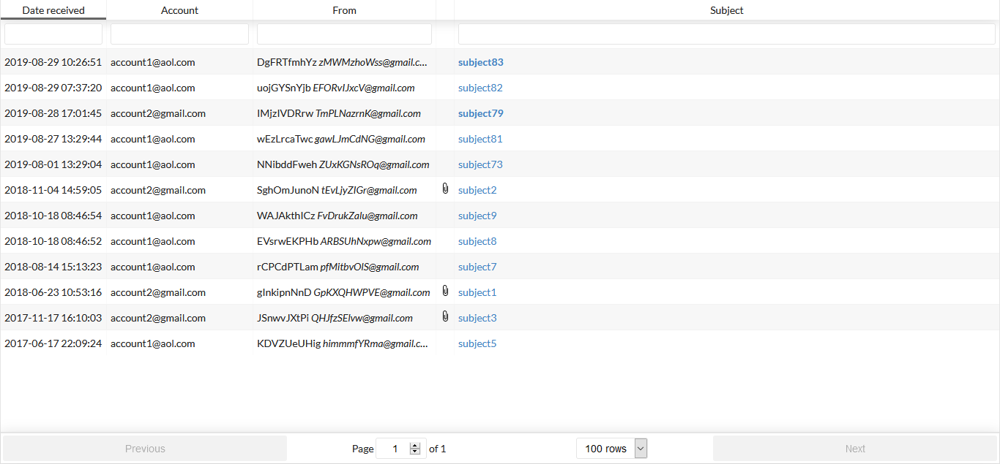
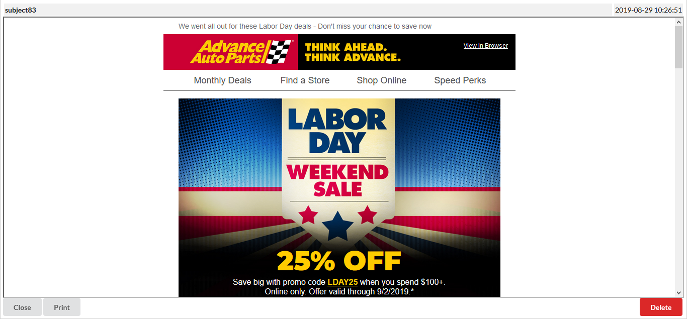

# Email

An email inbox aggregator, supporting listing emails via IMAP from Gmail and AOL in one aggregated view. Passwords are loaded from Bitwarden vault.





## Setup

Run the docker image with environment variables for:
```
accounts=<comma separated list of bitwarden IDs>
bitwardenEmailFolderId=<get from bitwarden CLI, bw list folders>
bitwardenCliLocation=<path to bitwarden CLI>
BW_CLIENTID=<get from bitwarden vault>
BW_CLIENTSECRET=<get from bitwarden vault>
```

## Steps to get bitwarden IDs

You must have the [BitWarden CLI](https://github.com/bitwarden/clients) installed.

- login `bw login <email>`
- unlock `bw unlock`
- find the folder ID using `bw list folders`
- find the IDs of the accounts you wish to sync by doing `bw list items --folderid <folderId>`