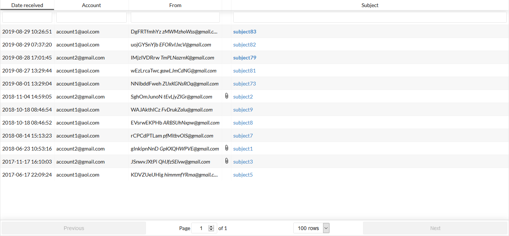
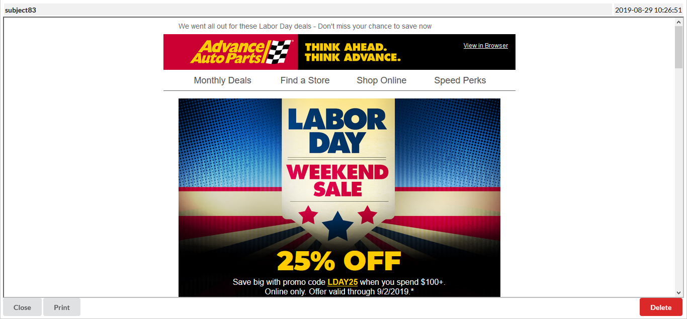

# Email

An email inbox aggregator, supporting listing emails via IMAP from Gmail and AOL in one aggregated view. Passwords are loaded from Bitwarden vault.





## Setup

Run the docker image with environment variables for:
```
accounts=<comma separated list of Bitwarden IDs>
bitwardenEmailFolderId=<get from Bitwarden CLI, bw list folders>
bitwardenCliLocation=<path to Bitwarden CLI>
BW_CLIENTID=<get from Bitwarden vault>
BW_CLIENTSECRET=<get from Bitwarden vault>
```
Note that if the account you have specified in Bitwarden does not end in "gmail.com" or "aol.com", but is actually one of those accounts, you can add a custom field called "hostname" and specify the IMAP server address, like "imap.gmail.com". This is useful for custom domains that are hosted using GSuite.

### Optional configuration settings:

- `messageProcessingTimeoutSeconds` (default `60`): number of seconds that should be spent processing each individual message before cancelling attempt to obtain message
- `closeStoreWhenCacheExpires` (default `true`): whether the `close` method should be called on an IMAP store when it expires from the cache. This was added because it seems that particularly slow IMAP providers (like gmail, sometimes), get `FolderClosedExceptions` when a `close` call occurs concurrently with opening a new store.
- `obfuscateAmazonOrderSubject` (default `false`): if true, Amazon.com order emails will have the item name obfuscated. This is useful for us because we share an Amazon account and I do not want to accidentally see what items are ordered if they are a gift

### Actual Budget integration

When viewing an email, the dollar sign button in the header opens a form to add a transaction to [Actual Budget](https://actualbudget.org/). This requires running [actual-http-api](https://github.com/jhonderson/actual-http-api) alongside your Actual Budget server. The form pre-fills the date, payee, and notes from the email, and tries to find dollar amounts in the email body. The account and category you select are remembered for next time.

Configuration:
```
actual.serverUrl=http://localhost:5007
actual.apiKey=<your actual-http-api key>
actual.syncId=<from Actual Budget Settings > Advanced > Sync ID>
actual.encryptionPassword=<only needed if your budget is encrypted>
```

## Steps to get Bitwarden IDs

You must have the [Bitwarden CLI](https://github.com/bitwarden/clients) installed.

- login `bw login <email>`
- unlock `bw unlock`
- find the folder ID using `bw list folders`
- find the IDs of the accounts you wish to sync by doing `bw list items --folderid <folderId>`

## Developer notes
### Running frontend against a remote backend
From the `src/frontend` directory, set `REACT_APP_BACKEND_URL` and run `npm start`:

```
REACT_APP_BACKEND_URL=https://your-backend.example.com npm start
```

This env var is read by the dev server proxy and the email body iframe to route requests to the backend.

Without it, `npm start` defaults to proxying to `http://localhost:8080`.
